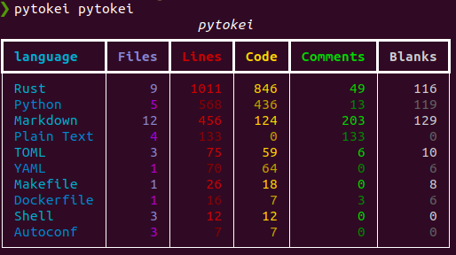

# Command Line Interface

`pytokei` can be used from the console (at least for a subset of the options that [`tokei`](https://github.com/XAMPPRocky/tokei) offers). 

The CLI is built using [`typer`](LINK) and [`rich`](LINK), so it should be self explanatory:

Only the compact report has been implemented:

With options to sort by the different variables, and ignore paths:

For the full detailed CLI you should use `tokei` directly.
